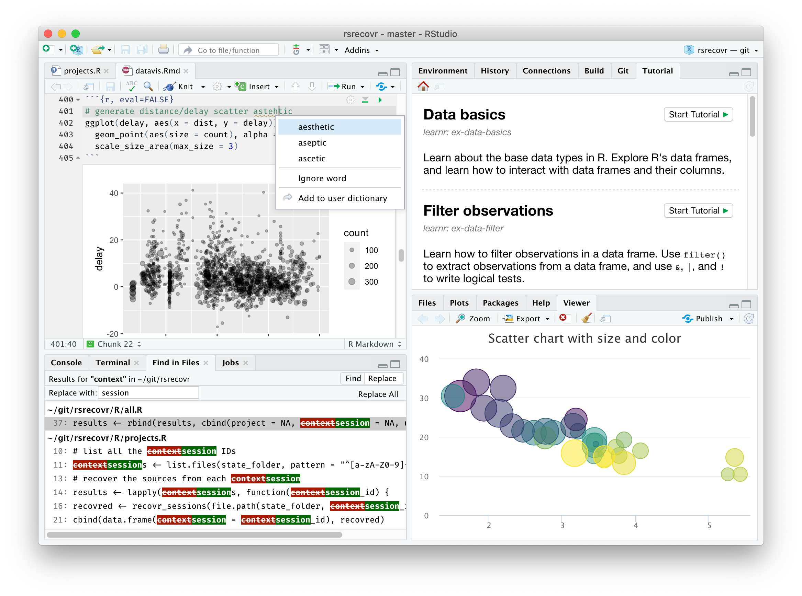
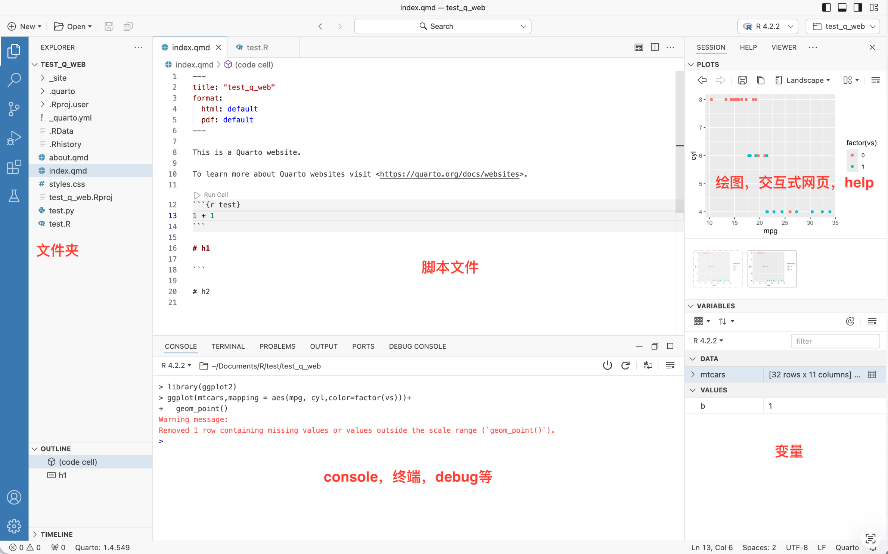

```{r, eval=TRUE, echo=FALSE, output=FALSE}
showtext::showtext_auto()
```

# 课程大纲

## 本讲内容

::: {.columns}
::: {.column width="50%"}
1. **数据科学与R语言**
2. **R对象**
3. **R向量**
4. **R常见数据结构**
:::
::: {.column width="50%"}
5. **运算符与向量运算**
6. **R编程**
7. **函数及应用**
8. **取子集**
:::
:::

---

# 第1部分：数据科学与R语言

## 1.1 什么是数据科学？

> 数据科学是利用**编程**、**统计**和**专业知识**从数据中提取价值的学科

::: {.columns}
::: {.column width="55%"}
### 数据科学三要素
- 🧮 **编程**：工具（R / Python）
- 📊 **统计**：灵魂
- 🔬 **专业**：核心（生物医学）

> 目的不是培养程序员，而是用数据推动学科发展
:::
::: {.column width="45%"}
### 数据科学流程
1. 数据导入
2. 数据规整（清洗）
3. 数据处理
4. 可视化
5. 建模
6. 可重复性报告
:::
:::

---

## 1.2 R是什么？

> 1992年，新西兰奥克兰大学 **Ross Ihaka** 和 **Robert Gentleman** 开发了R语言

- 🌐 官网：<https://www.r-project.org/>

::: {.columns}
::: {.column width="50%"}
### 核心特点

- 📊 统计计算与图形可视化
- 💻 跨平台：Windows / Mac / Linux
- 💰 开源免费（GPL协议）
- 📦 丰富的包生态系统
- 👥 活跃的社区支持
:::
::: {.column width="50%"}
### R在生物医学中的应用
- 🧬 RNA-seq差异表达（DESeq2）
- 🔬 单细胞测序分析（Seurat）
- 📈 临床数据统计（survival）
- 🗺️ 基因组注释（GenomicRanges）
- 📝 可重复研究（R Markdown/Quarto）
:::
:::

---

## 1.3 R大神与tidyverse

::: {.columns}
::: {.column width="55%"}
### Hadley Wickham

{width=30%}

2019年荣获**考普斯总统奖**（统计学诺贝尔奖）

- 创建了 **tidyverse** 生态系统
- 彻底改变了现代R编程风格
- 著有 *R for Data Science* 等经典书籍
- 个人主页：<https://hadley.nz/>
:::
::: {.column width="45%"}
### tidyverse：数据科学全家桶

```{r, eval=FALSE}
install.packages("tidyverse")
library(tidyverse)
```

核心包：

- `dplyr` — 数据处理
- `ggplot2` — 数据可视化
- `tidyr` — 数据整理
- `readr` — 数据读取
- `stringr` — 字符处理
:::
:::

tidyverse官网：<https://www.tidyverse.org/>

---

## 1.4 安装R和RStudio

### 安装步骤

::: {.columns}
::: {.column width="50%"}
**① 安装R**

- 官网：<https://cran.r-project.org/>
- 选择对应操作系统版本
- Windows/macOS/Linux均支持

**② 安装RStudio**

- 官网：<https://posit.co/download/rstudio-desktop/>
- 免费开源的集成开发环境
:::
::: {.column width="50%"}
**RStudio四大面板**

```
┌──────────────┬──────────────┐
│    源代码    │    环境/历史  │
│  (脚本编辑)  │  (变量查看)  │
├──────────────┼──────────────┤
│    控制台    │  文件/图形/  │
│  (命令输入)  │  包/帮助     │
└──────────────┴──────────────┘
```
:::
:::

## 1.4 安装R和RStudio

### RStudio




## 1.5 Positron - The Data Science IDE

- <https://positron.posit.co/>

::: {.columns}
{width="70%"}
::: 

---

# 第2部分：R对象

## 2.1 一切皆对象

> 在R中存储的数据称为**对象（object）**，R语言数据处理就是不断**创建和操控这些对象**

### R可以当计算器使用

```{r}
1 + 1
2 ^ 10
sqrt(16)
```

## 2.1 一切皆对象

### 查看对象类型

```{r}
class(3.14)
class("TP53")
class(TRUE)
```

---

## 2.2 对象的创建与赋值

> 使用赋值操作符 `<-` 或 `=` 将数据赋值给变量

```{r}
# 创建变量（相当于给盒子贴上名字并装入数据）
gene_name <- "TP53"        # 字符型
expression <- 8.5          # 数值型
is_DE <- TRUE              # 逻辑型
sample_count <- 100L       # 整数型

# 查看变量值
gene_name
expression
```

---

## 2.3 变量命名规则

::: {.columns}
::: {.column width="50%"}
### ✅ 合法的命名
- 字母、数字、下划线 `_`、句点 `.` 组成
- 第一个字符**必须是字母或句点**
- 区分大小写（`gene` ≠ `Gene`）

```r
gene_name <- "TP53"      # 推荐
patient.age <- 45        # 可用
x1 <- 100                # 简单
```
:::
::: {.column width="50%"}
### ❌ 非法的命名
```r
1gene <- "TP53"    # 数字开头❌
_expr <- 8.5       # 下划线开头❌
my gene <- "TP53"  # 含空格❌
```

### 💡 命名最佳实践
```r
# 描述清晰，使用小写+下划线
male_height_cm <- 175   # 最佳
maleHeight <- 175       # 可以
h <- 175                # 避免
```
:::
:::

---

## 2.4 对象属性

```{r}
x <- c(1.5, 2.3, 8.7, 4.1)

# 类型和长度是最重要的两个属性
typeof(x)       # 内部存储类型
class(x)        # 对象类型
length(x)       # 元素个数
```

## 2.5 属性与赋值

```{r}
# 属性赋值
names(x) <- c("S1", "S2", "S3", "S4")
attr(x, "unit") <- "FPKM"
attributes(x)
```

---

# 第3部分：R向量

## 3.1 向量：R的核心数据结构

> 向量（vector）是R最基础的数据类型，元素**类型统一**，用 `c()` 创建

::: {.columns}
::: {.column width="50%"}
### 创建向量

```{r}
# 数值型向量
expr <- c(8.5, 12.3, 6.7, 15.2, 9.1)

# 字符型向量
genes <- c("TP53", "KRAS", "BRCA1")

# 逻辑型向量
de_flag <- c(TRUE, FALSE, TRUE)

# 单个值也是长度为1的向量
x <- 6
length(x)
```
:::
::: {.column width="50%"}
### 生成序列

```{r}
# 整数序列
1:10

# 指定步长
seq(0, 1, by = 0.25)

# 重复
rep(c("Tumor", "Normal"), times = 3)
rep(c("Tumor", "Normal"), each = 3)
```
:::
:::

---

## 3.2 向量类型详解 - 数值型：integer vs double

```{r}
x_int <- 42L        # integer（整数，后缀L）
x_dbl <- 42.0       # double（浮点数）

typeof(x_int)
typeof(x_dbl)
is.integer(x_int)
```

## 3.2 向量类型详解 - 字符串型（String）

```{r}
gene <- "TP53"      # 双引号或单引号
sample_id <- 'GSM001'
nchar(gene)         # 字符串长度
```

---

## 3.3 因子型向量（factor）

> 因子是带有**层级（Levels）**的字符串向量，用于表示分类变量

```{r}
# 创建因子
stage <- factor(c("I", "II", "III", "II", "IV", "I"))
stage
levels(stage)
table(stage)
```

## 3.3 因子型向量（factor）

```{r}
# 有序因子（如温度等级）
severity <- factor(c("mild", "severe", "moderate", "mild"),
                   levels = c("mild", "moderate", "severe"),
                   ordered = TRUE)
severity
severity[1] < severity[2]
```

---

## 3.4 命名向量

```{r}
# 每个元素可以有名字
expr <- c(TP53 = 8.5, KRAS = 12.3, BRCA1 = 6.7, MYC = 15.2)
expr

# 访问命名元素
expr["TP53"]
names(expr)
```

---

## 3.5 强制类型转换

> 向量元素**必须是同一类型**，若类型不同，R自动转换（**强制转换**）

### 转换层级规则

```
character > numeric > logical
double > integer
```

## 3.5 强制类型转换

```{r}
# 混合类型会自动转换
c(1, "USA", TRUE)   # 全部变为字符型
c(1, TRUE, FALSE)   # 逻辑→数值
```

## 3.5 强制类型转换

```{r}
# 显式转换
as.numeric("3.14")
as.character(100)
as.logical(0)
```

---

# 第4部分：R常见数据结构

## 4.1 基础数据结构概览

| 数据结构 | 维度 | 元素类型 | 适用场景 |
|---------|------|---------|---------|
| `vector` | 1维 | 统一 | 单列数据、序列 |
| `matrix` | 2维 | 统一 | 基因表达矩阵 |
| `list` | 任意 | 混合 | 分析结果集合 |
| `data.frame` | 2维 | 混合 | 临床数据表格 |

> 💡 矩阵、列表、数据框都可以看作**向量的衍生结构**

---

## 4.2 矩阵（matrix）

> 矩阵是**二维**的向量，所有元素类型相同

```{r}
# 创建基因表达矩阵
expr_mat <- matrix(
  c(8.5, 12.3, 6.7, 15.2,
    5.2,  7.8, 9.1,  6.5,
    3.1,  4.5, 8.2,  7.9),
  nrow = 3, byrow = TRUE
)

# 行列命名
rownames(expr_mat) <- c("TP53", "KRAS", "BRCA1")
colnames(expr_mat) <- c("S1", "S2", "S3", "S4")
expr_mat
```

## 4.2 矩阵（matrix）

```{r}
dim(expr_mat)     # 维度
nrow(expr_mat)    # 行数
ncol(expr_mat)    # 列数
```

---

## 4.3 列表（list）

> 列表像一列火车，每节车厢可以装**不同类型**的数据

```{r}
# 存储分析结果
result <- list(
  gene     = "TP53",
  expr     = c(8.5, 12.3, 6.7, 15.2),
  p_value  = 0.0023,
  is_DE    = TRUE
)

result
```

## 4.3 列表（list）

```{r}
# 访问元素
result$gene
result[["p_value"]]
result[[2]]
```

---

## 4.4 数据框（data.frame）

> 数据框 = **等长向量组成的列表**，类似Excel表格，生物信息学最常用数据结构

```{r}
# 患者临床数据
patients <- data.frame(
  id        = c("P001", "P002", "P003", "P004", "P005"),
  age       = c(45, 52, 38, 61, 29),
  gender    = c("M", "F", "F", "M", "F"),
  stage     = c("II", "III", "I", "IV", "II"),
  tp53_expr = c(8.5, 12.3, 6.7, 15.2, 9.1)
)
patients
```

---

## 4.5 数据框操作

```{r}
# 查看结构
str(patients)
dim(patients)
```

## 4.5 数据框操作

```{r}
# 访问列（三种方式等价）
patients$age
patients[["age"]]
patients[, "age"]
```

## 4.5 数据框操作

```{r}
# 筛选行
patients[patients$age > 50, ]
subset(patients, stage == "III" | stage == "IV")
```

---

# 第5部分：运算符与向量运算

## 5.1 算术运算符

```r
x <- c(10, 20, 30, 40)
y <- c(2, 4, 5, 8)

x + y     # 加法
x - y     # 减法
x * y     # 乘法
x / y     # 除法
x ^ 2     # 乘方
x %% y    # 取余（模运算）
x %/% y   # 整除
```

---

## 5.2 循环补齐原则

> 两个向量长度不等时，**短向量会循环补齐**至长向量的长度

```{r}
# 标量（长度1）与向量运算
c(1, 2, 3, 4) * 2

# 长度整数倍关系
c(1, 2, 3, 4) + c(10, 20)   # c(10,20)补齐为c(10,20,10,20)
```

## 5.2 循环补齐原则

```{r}
# ⚠️ 非整数倍时R会警告
c(1, 2, 3) + c(10, 20)
```

---

## 5.3 关系运算符

```r
x <- c(8.5, 12.3, 6.7, 15.2, 9.1)

x > 10        # 大于
x >= 10       # 大于等于
x == 9.1      # 等于（注意是==）
x != 9.1      # 不等于
```


## 5.3 关系运算符

```{r}
x <- c(8.5, 12.3, 6.7, 15.2, 9.1)

# 找出高表达基因的位置
which(x > 10)
x[x > 10]
```

---

## 5.4 逻辑运算符

```r
a <- c(TRUE, TRUE, FALSE, FALSE)
b <- c(TRUE, FALSE, TRUE, FALSE)

a & b     # 元素级 AND（两者均TRUE）
a | b     # 元素级 OR（至少一个TRUE）
!a        # 取反
```

## 5.4 逻辑运算符

```{r}
# 实际应用：多条件筛选
x <- c(8.5, 12.3, 6.7, 15.2, 9.1)
x[x > 8 & x < 13]    # 中等表达水平
```

---

## 5.5 特殊值

> R中有四种特殊值，在数据分析中需要特别注意

```{r}
# Inf：无限大
1 / 0;  -1 / 0

# NaN：非数（Not a Number）
0 / 0;  log(-1)
```

## 5.5 特殊值

```{r}
# NA：缺失值（Not Available）
x <- c(8.5, NA, 12.3, NA, 6.7)
is.na(x)
mean(x, na.rm = TRUE)   # 忽略NA计算

# NULL：空对象
y <- NULL
is.null(y)
```

---

## 5.6 其他运算符

```{r}
# %in%：判断元素是否在集合中
c("TP53", "BRCA1", "EGFR") %in% c("TP53", "KRAS")

# 管道运算符（R 4.1+原生支持）
c(1, 5, 3, 2, 4) |> sort() |> rev()
```

```{r}
# seq_along：生成与向量等长的序列
genes <- c("TP53", "KRAS", "BRCA1")
seq_along(genes)   # 替代1:length(genes)
```

---

# 第6部分：R编程

## 6.1 if 语句

```{r}
# 根据表达量分类
expr_mean <- 12.5

if (expr_mean > 15) {
  cat("高表达\n")
} else if (expr_mean > 10) {
  cat("中等表达\n")
} else {
  cat("低表达\n")
}
```

## 6.1 if 语句

```{r}
# ifelse：向量化条件判断
x <- c(8.5, 12.3, 6.7, 15.2, 9.1)
ifelse(x > 10, "高表达", "低表达")
```

---

## 6.2 for 循环

> 对**序列（向量）**中的元素依次进行处理

```{r}
# 计算多个基因的标准化值
genes <- c("TP53", "KRAS", "BRCA1")
expr  <- c(8.5, 12.3, 6.7)

for (i in seq_along(genes)) {
  zscore <- (expr[i] - mean(expr)) / sd(expr)
  cat(genes[i], "z-score:", round(zscore, 2), "\n")
}
```

## 6.2 for 循环

```{r}
# break：找到第一个高表达基因后退出
for (i in seq_along(expr)) {
  if (expr[i] > 10) {
    cat("第一个高表达基因:", genes[i], "\n")
    break
  }
}
```

---

## 6.3 while 和 repeat 循环

```{r}
# while循环：满足条件则继续
diff <- 1.0; iter <- 0
while (diff > 0.01) {
  diff <- diff * 0.5
  iter <- iter + 1
}
cat("迭代次数:", iter, "\n")
```

```{r}
# repeat：无条件循环，必须用break退出
x <- 1
repeat {
  x <- x * 2
  if (x >= 16) break
}
x
```

---

# 第7部分：函数及应用

## 7.1 内置函数

> R的强大就在于丰富的**内置函数**，与数学函数 y = f(x) 概念一致

```{r}
x <- c(2, 7, 8, 9, 3, 1, 5)

# 汇总函数（返回单个值）
mean(x); median(x); sd(x); var(x)
min(x); max(x); sum(x); length(x)
```

## 7.1 内置函数

```{r}
# 向量化函数（返回等长向量）
sqrt(x)
log2(x)
abs(c(-3, 5, -1))
round(c(3.14159, 2.71828), digits = 2)
```

---

## 7.2 向量化函数 vs 汇总函数

| 类型 | 输入 | 输出 | 示例 |
|------|------|------|------|
| **向量化函数** | 向量（n个元素）| 向量（n个元素）| `sqrt()`, `log2()` |
| **汇总函数** | 向量（n个元素）| 标量（1个元素）| `mean()`, `sum()` |
| **其他** | 向量 | 不等长向量 | `unique()`, `table()` |

## 7.2 向量化函数 vs 汇总函数

```{r}
x <- c(2, 7, 8, 9, 3)
x ^ 2 + 5               # 向量化运算
x - mean(x)             # 减去均值
(x - mean(x)) / sd(x)   # Z-score标准化
```

---

## 7.3 自定义函数

> 减少代码重复，提升编程效率

```{r}
# 定义Z-score标准化函数
my_std <- function(x) {
  (x - mean(x)) / sd(x)
}

# 对多个向量应用
x <- c(2, 7, 8, 9, 3)
y <- c(1, 5, 7, 8, 9, 3)
my_std(x)
my_std(y)
```

## 7.3 自定义函数

```{r}
# 带默认参数的函数
analyze_expr <- function(expr, threshold = 10, log2_transform = FALSE) {
  if (log2_transform) expr <- log2(expr + 1)
  high <- expr[expr > threshold]
  list(n_high = length(high), mean_high = mean(high))
}
analyze_expr(c(8.5, 12.3, 6.7, 15.2, 9.1))
```

---

## 7.4 使用三方包函数

```{r, eval=FALSE}
# 安装并加载包
install.packages("dplyr")
library(dplyr)

# 若多个包有同名函数，用::明确指定
dplyr::select(patients, age, stage)
```

### 获取帮助

```{r, eval=FALSE}
?mean                    # 查看函数文档
help(package = "dplyr")  # 查看包文档
example(mean)            # 运行示例
```

---

# 第8部分：取子集

## 8.1 子集选取概述

> 从对象中提取**部分数据**，是数据分析的基本操作

| 操作符 | 适用对象 | 说明 |
|-------|---------|------|
| `[` | 全部 | 返回**同类型**子集 |
| `[[` | 列表/数据框 | 返回**单个元素** |
| `$` | 列表/数据框 | 按**名字**访问元素 |

---

## 8.2 向量取子集

```{r}
x <- c(8.5, 12.3, 6.7, 15.2, 9.1)
names(x) <- c("S1", "S2", "S3", "S4", "S5")

# 位置索引（R从1开始！）
x[1];  x[c(1, 3, 5)];  x[2:4]
```

## 8.2 向量取子集

```{r}
# 逻辑索引
x[x > 10]

# 命名索引
x[c("S1", "S3")]

# 负索引（排除）
x[-2]
```

---

## 8.3 矩阵取子集

```{r}
# 行列位置
expr_mat[1, ]           # 第1行（TP53）
expr_mat[, 1:2]         # 前2列（S1, S2）
expr_mat["KRAS", "S2"]  # 按名字
```

## 8.3 矩阵取子集

```{r}
# 矩阵运算
apply(expr_mat, 1, mean)   # 每行均值（1=行）
apply(expr_mat, 2, mean)   # 每列均值（2=列）
```

---

## 8.4 列表与数据框取子集

```{r}
# 列表取子集：[]返回列表，[[]]返回元素本身
result[1]         # 返回列表
result[[1]]       # 返回元素本身
result$gene       # 等价于result[["gene"]]
```

## 8.4 列表与数据框取子集

```{r}
# 数据框取子集
patients[1:3, ]                          # 前3行
patients[, c("id", "age", "stage")]      # 指定列
patients[patients$age > 50, ]            # 条件筛选行
patients[patients$stage == "IV", "id"]   # 筛选行+列
```

---

# 课程总结

## 本讲要点回顾

::: {.columns}
::: {.column width="50%"}
### 数据结构
- **vector**：最基础，元素类型统一
- **matrix**：二维向量，同类型
- **list**：灵活容器，类型混合
- **data.frame**：等长向量列表，最常用

### 向量类型
- numeric (double/integer)
- character, logical, **factor**
- 强制转换规则
:::
::: {.column width="50%"}
### 编程要素
- 赋值 `<-`，命名规范
- 运算符：算术、关系、逻辑
- 特殊值：`NA`, `NaN`, `Inf`, `NULL`
- 循环：`for`, `while`, `repeat`
- 条件：`if/else`, `ifelse()`

### 函数与取子集
- 内置函数：向量化 vs 汇总
- 自定义函数
- 取子集：`[`, `[[`, `$`
:::
:::

---

## 课程作业

> 使用 **R Markdown** 生成报告按要求提交

```{r, eval=FALSE}
set.seed(学号)
weight <- rnorm(20, mean = 60, sd = 15)
height <- rnorm(20, mean = 170, sd = 20)
```

### 任务
1. 自定义函数，根据**方差公式**写出方差计算函数，与 `var()` 对比
2. 自定义函数，根据身高 `height`（cm）和体重 `weight`（kg）计算 **BMI**
   $$BMI = \frac{weight}{(height/100)^2}$$
3. 自定义函数，对向量 `x` 和阈值 `threshold`（默认60），计算所有**大于阈值元素的均值**

---

## 参考资料

- 📖 王敏杰，《数据科学中的R语言》  
  <https://bookdown.org/wangminjie/R4DS/>

- ⚡ Hadley Wickham，*R for Data Science*（第2版）

  <https://r4ds.hadley.nz/> 
  
  <https://sunpast.github.io/r4ds/>（丁加笔记📒）

- 📋 Posit R Cheatsheets（速查表）  
  <https://posit.co/resources/cheatsheets/>

---

## 下节预告

### 我们将学习

- 📝 **Markdown** 基础语法
- 📊 **R Markdown** 文档结构
- ⚙️ 代码块选项与输出控制
- 🌐 **Quarto** 现代工作流
- ♻️ 可重复性研究最佳实践

---

## Questions?

王诗翔 副教授  
中南大学生物医学信息系

📧 wangshx@csu.edu.cn  
🐙 <https://github.com/WangLabCSU>

# 谢谢！
