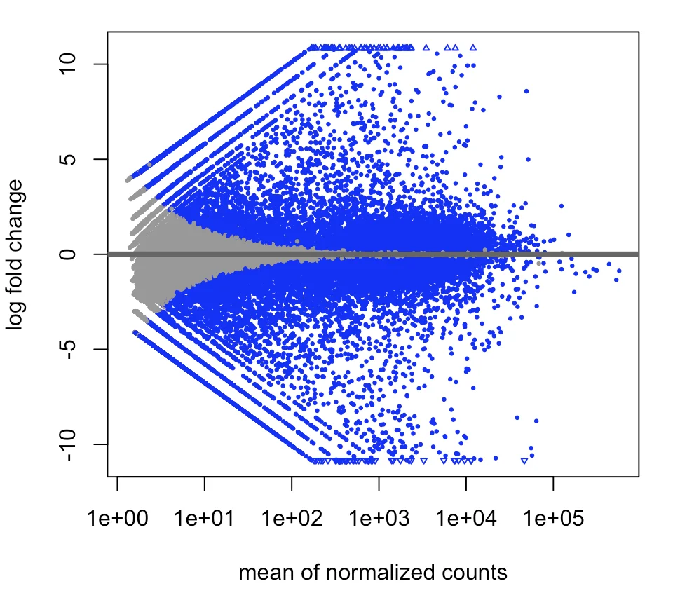
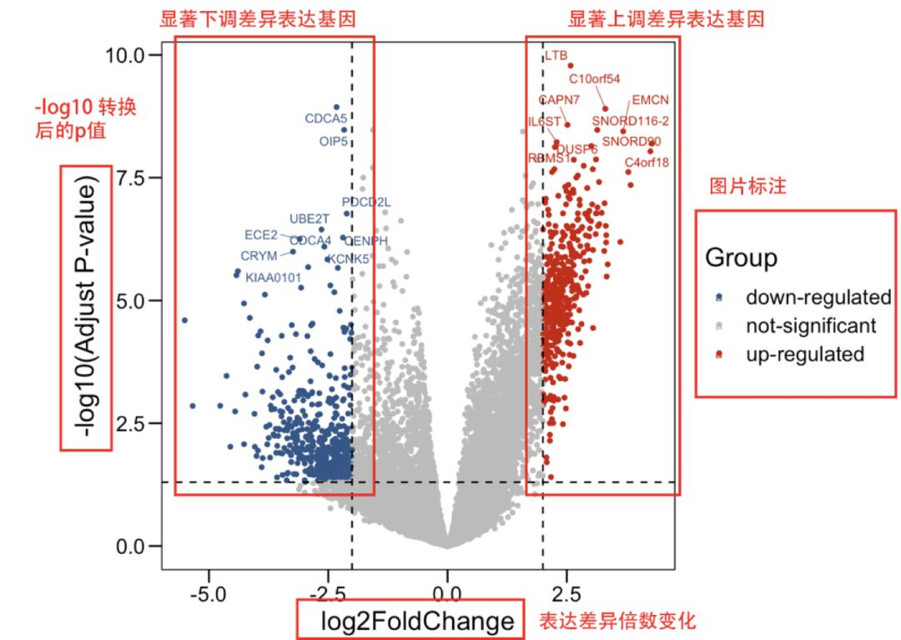
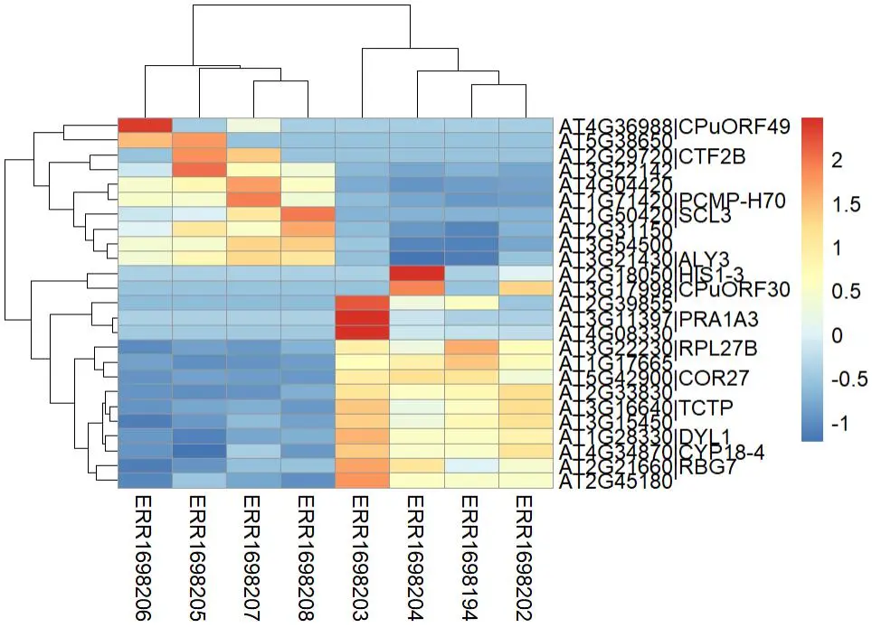

```{r, eval=TRUE, echo=FALSE, output=FALSE}
showtext::showtext_auto()
```

# 课程大纲

## 本讲内容

::: {.columns}
::: {.column width="50%"}
1. **差异表达分析概述**
2. **RNA-seq数据统计特性**
3. **DESeq2原理与流程**
4. **edgeR简介**
:::
::: {.column width="50%"}
5. **多重检验校正**
6. **结果解读与筛选**
7. **结果可视化**
8. **常见问题**
:::
:::

---

# 第1部分：差异表达分析概述

## 1.1 什么是差异表达？

**差异表达基因（DEGs）**：在不同条件下表达水平发生显著变化的基因

```
对照组              处理组
├─┤                 ├────┤
表达量=10           表达量=20
    ↓
 Fold Change = 2
```

### 分析目标

- 识别处理/疾病相关的关键基因
- 理解生物学过程的分子机制
- 发现潜在的生物标志物或药物靶点

---

## 1.2 分析流程

```
原始counts矩阵
      ↓
  数据过滤 (低表达基因)
      ↓
  标准化 (size factors)
      ↓
  离散度估计
      ↓
  统计检验 (Wald test/LRT)
      ↓
  多重检验校正 (BH)
      ↓
  差异基因筛选 (padj < 0.05, |log2FC| > 1)
```

---

# 第2部分：RNA-seq数据统计特性

## 2.1 计数数据的分布特性

RNA-seq计数数据具有以下特点：

1. **离散型** — 非负整数
2. **过度离散** — 方差 > 均值
3. **零膨胀** — 大量基因在某些样本中为0

## 分布可视化对比 {.smaller}

```{r}
#| fig-width: 10
#| fig-height: 4

# 1. 设置参数（修正负二项参数，确保方差差异显著）
mu <- 20  # 三种分布的均值统一为20
alpha <- 0.5  # 负二项离散度参数，alpha越大离散程度越高

set.seed(42)  # 固定随机种子，结果可复现

# 2. 生成三种分布数据
## 正态分布（t检验假设）：方差=均值=20，标准差=sqrt(20)≈4.47
normal_data <- rnorm(1000, mean = mu, sd = sqrt(mu))

## 泊松分布（传统计数模型假设）：方差=均值=20/4
poisson_data <- rpois(1000, lambda = mu/4)

## 负二项分布（过离散计数模型）：修正参数，确保方差=mu + alpha*mu²=20+0.5*400=220
# R中rnbinom的size参数对应GLM中的theta，和alpha的关系为：size = 1/alpha
size <- 1 / alpha  # 此时size=2，方差=20 + 20²/2 = 220
nb_data <- rnbinom(1000, size = size, mu = mu)

# 3. 验证三种分布的统计量（可选，确认参数设置正确）
cat("=== 分布统计量验证 ===\n")
cat(sprintf("正态分布：均值=%.2f，方差=%.2f\n", mean(normal_data), var(normal_data)))
cat(sprintf("泊松分布：均值=%.2f，方差=%.2f\n", mean(poisson_data), var(poisson_data)))
cat(sprintf("负二项分布：均值=%.2f，方差=%.2f\n", mean(nb_data), var(nb_data)))

# 4. 整理数据为长格式，方便ggplot绘图
df <- data.frame(
  value = c(normal_data, poisson_data, nb_data),
  distribution = rep(c("正态分布\n(Var≈20)", 
                       "泊松分布\n(Var≈20)", 
                       "负二项分布\n(Var≈220)"), each = 1000)
)

# 5. 可视化对比（修正坐标轴尺度，补充密度曲线）
library(ggplot2)

ggplot(df, aes(x = value, fill = distribution, color = distribution)) +
  # 直方图：用密度刻度，方便和密度曲线叠加
  geom_histogram(aes(y = after_stat(density)), 
                 bins = 40, alpha = 0.3, position = "identity", color = NA) +
  # 叠加核密度曲线，更直观展示分布形态
  geom_density(alpha = 0.5, linewidth = 1) +
  # 分面：固定坐标轴尺度，强制所有分面使用相同的x/y轴范围，差异更明显
  facet_wrap(~ distribution, scales = "fixed") +
  # 添加均值参考线
  geom_vline(xintercept = mu, linetype = "dashed", color = "red", linewidth = 0.8) +
  theme_minimal(base_size = 12) +
  labs(x = "数值", y = "密度", 
       title = "三种分布对比（均值 μ = 20，离散度 α = 0.5）",
       subtitle = "红色虚线为均值参考线，负二项分布离散程度显著高于前两者") +
  theme(
    strip.text = element_text(size = 11, face = "bold"),
    legend.position = "none",  # 分面后不需要图例
    panel.grid.minor = element_blank()
  )

# 6. 额外：箱线图对比离散程度（更直观展示波动差异）
ggplot(df, aes(x = distribution, y = value, fill = distribution)) +
  geom_boxplot(alpha = 0.7) +
  theme_minimal(base_size = 12) +
  labs(x = "分布类型", y = "数值", title = "三种分布的离散程度箱线图对比") +
  theme(legend.position = "none")

```

## 分布可视化对比 {.small}

::: {.callout-note}
### 图解说明

| 分布 | 数据类型 | 方差-均值关系 | 适用场景 |
|------|----------|---------------|----------|
| **正态分布** | 连续 | $\text{Var} = \sigma^2$ | t检验、ANOVA |
| **泊松分布** | 离散 | $\text{Var} = \mu$ | 理想计数数据 |
| **负二项分布** | 离散 | $\text{Var} = \mu + \alpha\mu^2$ | RNA-seq计数数据 |

从图中可以看到：

- 正态分布连续且对称
- 泊松分布离散，方差与均值相近
- **负二项分布离散，尾部更长（过度离散特征）**
:::

### 为什么不能直接用t检验？

- 正态分布：均值 = 方差
- RNA-seq数据：方差通常 >> 均值（过度离散）

---

## 2.2 负二项分布

**负二项分布（Negative Binomial）**：

RNA-seq 计数数据 $K$ 服从负二项分布：

$$K \sim \text{NB}(\mu, r)$$

**均值与方差的关系**：

$$\text{E}[K] = \mu$$

$$\text{Var}[K] = \mu + \frac{\mu^2}{r} = \mu + \alpha \mu^2$$

其中：

- $r$：**size 参数**（与离散度相关）
- $\alpha = 1/r$：**离散度参数**（dispersion parameter）

## 2.2 负二项分布

::: {.callout-tip}
### 参数化说明

负二项分布有多种参数化方式，DESeq2/edgeR 文献中通常使用：

$$\text{Var}[K] = \mu + \alpha \mu^2$$

- $\alpha$ 越大 → 方差越大 → 过度离散越严重
- $\alpha = 0$ → 方差 = $\mu$ → 退化为泊松分布

R 中 `rnbinom(n, size, mu)` 的 `size` 参数即对应 $r = 1/\alpha$。
:::

| 离散度 $\alpha$ | 方差 vs 均值 | 分布类型 |
|-----------------|--------------|----------|
| $\alpha = 0$ | $\text{Var} = \mu$ | 泊松分布（无过度离散） |
| $\alpha > 0$ | $\text{Var} > \mu$ | 负二项分布（过度离散） |
| $\alpha$ 大 | $\text{Var} >> \mu$ | 高度过度离散 |

## 实际应用

| 基因类型 | 离散度 $\alpha$ | 原因 |
|----------|-----------------|------|
| **低表达基因** | 高 | 采样误差大，计数波动大 |
| **高表达基因** | 低 | 采样误差小，计数稳定 |

::: {.callout-note}
### 💡 为什么不用泊松分布？

泊松分布假设 $\text{Var} = \mu$，但 RNA-seq 数据通常 $\text{Var} >> \mu$（过度离散）。

直接使用泊松分布会导致：

- 标准误估计过小
- p 值过于激进
- 假阳性过多
:::

---

# 第3部分：DESeq2原理与流程

## 3.1 DESeq2核心原理 {.small}

**负二项广义线性模型（GLM）**：

对于基因 $i$ 在样本 $j$ 的计数 $K_{ij}$，DESeq2 建模如下：

$$K_{ij} \sim \text{NB}(\mu_{ij}, r_i)$$

$$\text{Var}[K_{ij}] = \mu_{ij} + \alpha_i \mu_{ij}^2$$

$$\log_2(\mu_{ij}) = \beta_{i0} + \beta_{i1} \cdot x_j$$

其中：

- $K_{ij}$：基因 $i$ 在样本 $j$ 中的观测计数
- $\mu_{ij}$：基因 $i$ 在样本 $j$ 中的期望计数（经过 Size Factor 校正）
- $r_i$：基因 $i$ 的 size 参数
- $\alpha_i = 1/r_i$：基因 $i$ 的**离散度参数**
- $\beta_{i0}$：截距项（对照组的基线表达水平）
- $\beta_{i1}$：处理效应（即 $\log_2$ Fold Change）
- $x_j$：样本 $j$ 的条件指示变量（0 = 对照组，1 = 处理组）

## 模型解读

$$\text{Fold Change} = 2^{\beta_{i1}}$$

| 参数 | 含义 | 生物学意义 |
|------|------|------------|
| $\beta_{i1} = 1$ | $\log_2\text{FC} = 1$ | 处理组表达量是对照组的 **2 倍** |
| $\beta_{i1} = 2$ | $\log_2\text{FC} = 2$ | 处理组表达量是对照组的 **4 倍** |
| $\beta_{i1} = -1$ | $\log_2\text{FC} = -1$ | 处理组表达量是对照组的 **0.5 倍** |

### DESeq2分析步骤

1. 估计 size factors（中位数比值法标准化）
2. 估计基因离散度 $\alpha_i$（趋势拟合 + 收缩）
3. 拟合负二项 GLM
4. Wald 检验或似然比检验（检验 $\beta_{i1} \neq 0$）

---

## 3.2 Size Factor标准化 {.small}

**中位数比值法（Median Ratio Method）**：

对于样本 $j$，其 Size Factor 计算公式为：

$$s_j = \text{median}_i \left( \frac{K_{ij}}{\hat{q}_i} \right)$$

其中：

- $K_{ij}$：基因 $i$ 在样本 $j$ 中的原始计数
- $\hat{q}_i$：基因 $i$ 在所有样本中的几何平均值

$$\hat{q}_i = \left( \prod_{j=1}^{m} K_{ij} \right)^{1/m}$$

### 计算步骤

1. 计算每个基因的几何平均值 $\hat{q}_i$
2. 计算每个样本中各基因与几何平均值的比值 $\frac{K_{ij}}{\hat{q}_i}$
3. 取所有基因比值的中位数作为该样本的 Size Factor

---

## 3.3 Size Factor 深入理解 {.small}

::: {.callout-warning}
### ⚠️ 重要：Size Factor ≠ Library Size 归一化

**常见困惑**：某样本 Library Size 很大，但 Size Factor < 1？

这是学习者常遇到的问题！关键在于理解中位数比值法的原理。
:::

### 可能出现该现象的原因

| 原因 | 解释 |
|------|------|
| **表达分布不均** | 总 reads 多但集中在少数高表达基因 |
| **几何平均效应** | 大多数基因表达低于几何平均值 |
| **RNA 组成偏好** | 特定基因大幅上调，"吸收"测序资源 |

### 类比理解

$$\text{Size Factor} \approx \text{中位数收入}$$

- 国家 A：总收入 100 亿，90% 财富在 1% 富人手中 → **中位数收入低**
- 国家 B：总收入 80 亿，分配均匀 → **中位数收入可能更高**

**中位数不受极端值影响**，这正是 DESeq2 对 RNA 组成偏好稳健的原因！

---

## 3.4 Size Factor 示例

| 样本 | 总reads | Size Factor | 情况说明 |
|------|---------|-------------|----------|
| A | 10M | 1.0 | 基准样本（中位数比值 = 1） |
| B | 20M | 2.0 | 测序深度 2 倍，多数基因表达翻倍 |
| C | 8M | 0.8 | 测序深度 0.8 倍 |
| D | 20M | 0.9 | 总 reads 高，但集中在少数基因 ⚠️ |

**样本 D 的解释**：

虽然 Library Size = 20M（与 B 相同），但：

- 少数超高表达基因"贡献"了大量 reads
- 大多数基因表达量低于几何平均值
- 中位数比值 < 1，所以 Size Factor = 0.9

---

## 3.5 DESeq2代码示例 {.small}

```r
# 1. 创建DESeq2对象
dds <- DESeqDataSetFromMatrix(
  countData = counts_matrix,
  colData = sample_info,
  design = ~ condition
)

# 2. 过滤低表达基因
keep <- rowSums(counts(dds)) >= 10
dds <- dds[keep, ]

# 3. 运行DESeq2
dds <- DESeq(dds)

# 4. 提取结果
res <- results(dds,
               contrast = c("condition", "treat", "ctrl"))
```

---

# 第4部分：edgeR简介

## 4.1 edgeR特点

- 同样基于负二项分布
- 使用经验贝叶斯估计离散度
- 适用于复杂实验设计

### edgeR代码示例

```r
# 创建DGEList对象
dge <- DGEList(counts = counts,
               group = condition)

# 过滤和标准化
keep <- filterByExpr(dge)
dge <- dge[keep, ]
dge <- calcNormFactors(dge)

# 离散度估计和检验
dge <- estimateDisp(dge)
et <- exactTest(dge)
```

---

## 4.2 DESeq2 vs edgeR

| 特性 | DESeq2 | edgeR |
|------|--------|-------|
| 离散度估计 | 趋势拟合 | 经验贝叶斯 |
| 收缩性 | 更强 | 较弱 |
| 小样本稳健性 | 更好 | 中等 |
| 复杂设计 | 支持 | 支持 |
| 速度 | 较慢 | 较快 |

**推荐**：

- 样本少（n=3）：DESeq2更稳健
- 样本多或复杂设计：两者均可

---

# 第5部分：多重检验校正

## 5.1 为什么需要校正？

假设检测20,000个基因，每个基因单独检验（α=0.05）：

```
假阳性期望数 = 20,000 × 0.05 = 1,000个！
```

### Benjamini-Hochberg (BH) 方法

**控制假发现率（FDR）**：

```
FDR = E[假阳性数 / 拒绝数]
```

**BH校正**：找到最大的k，使得 p_k ≤ (k/m) × α

---

## 5.2 p值 vs FDR

| 指标 | 符号 | 含义 | 使用场景 |
|------|------|------|----------|
| p值 | pvalue | 单次检验错误概率 | 不推荐直接使用 |
| 调整p值 | padj | FDR控制 | 差异基因筛选 |

### 差异基因筛选标准

```
推荐阈值：
- |log2FC| > 1  （倍数变化 > 2）
- padj < 0.05  （FDR < 5%）
```

---

# 第6部分：结果解读

## 6.1 DESeq2结果表

| 列名 | 含义 | 说明 |
|------|------|------|
| baseMean | 平均表达量 | 标准化后的平均reads数 |
| log2FoldChange | log2倍数变化 | 处理组/对照组 |
| lfcSE | log2FC标准误 | 估计的不确定性 |
| stat | Wald统计量 | 检验统计量 |
| pvalue | 原始p值 | 未校正 |
| padj | 校正p值 | BH校正后 |

---

## 6.2 结果分类解读

```
           padj < 0.05
            Yes     No
        ┌────────┬────────┐
 log2FC  │        │        │
  > 1    │ 上调   │ nominally上调 │
        │  (Up)  │        │
        ├────────┼────────┤
  -1 to 1│ 无差异 │ 无差异 │
        │        │        │
        ├────────┼────────┤
  < -1   │ 下调   │ nominally下调 │
        │ (Down) │        │
        └────────┴────────┘
```

---

# 第7部分：结果可视化

## 7.1 MA图 {.small}

**MA图**：表达量（mean）vs 差异倍数（log2FC）

::: {.columns}
{fig-align="center" width="40%"}
:::

**特点**：

- 低表达基因log2FC波动大
- 高表达基因趋于稳定

---

## 7.2 火山图

**火山图**：log2FC vs -log10(padj)

::: {.columns}
{fig-align="center" width="60%"}
:::

**优点**：同时展示变化倍数和统计显著性

---

## 7.3 热图

**差异基因表达热图**：

::: {.columns}
{fig-align="center" width="60%"}
:::

**用途**：展示Top差异基因的表达模式

---

# 第8部分：常见问题

## 8.1 常见问题解答

### Q1: 无差异基因或差异基因过多？

| 问题 | 可能原因 | 解决方案 |
|------|----------|----------|
| 无差异基因 | 分组错误 | 检查colData |
| | 批次效应 | 添加批次到设计公式 |
| | 阈值过严 | 适当放宽阈值 |
| 差异基因过多 | 生物学差异大 | 检查样本质量 |
| | 阈值过松 | 使用更严格阈值 |

---

## 8.1 常见问题解答

### log2FC收缩

**问题**：低表达基因的高log2FC不可靠

**DESeq2解决方案**：

```r
# log2FC收缩
resLFC <- lfcShrink(dds,
                    coef = "condition_treat_vs_ctrl")
```

**效果**：

- 低表达基因：log2FC向0收缩
- 高表达基因：保持相对稳定

---

# 总结

## 差异表达分析要点

1. **统计基础** — RNA-seq数据符合负二项分布，存在过度离散
2. **DESeq2核心** — 负二项GLM + 中位数比值标准化 + Wald检验
3. **多重校正** — 使用BH方法控制FDR
4. **筛选标准** — |log2FC| > 1 + padj < 0.05
5. **结果解读** — 关注表达量、变化倍数、统计显著性

---

# 谢谢！

## 联系方式

- 📧 wangshx@csu.edu.cn
- 🌐 https://wanglabcsu.github.io/
- 🐙 https://github.com/WangLabCSU

---

## 延伸阅读

1. Love MI, et al. Moderated estimation of fold change and dispersion for RNA-seq data with DESeq2. Genome Biol. 2014
2. Robinson MD, et al. edgeR: a Bioconductor package for differential expression analysis. Bioinformatics. 2010
3. Law CW, et al. voom: precision weights unlock linear model analysis tools for RNA-seq read counts. Genome Biol. 2014
