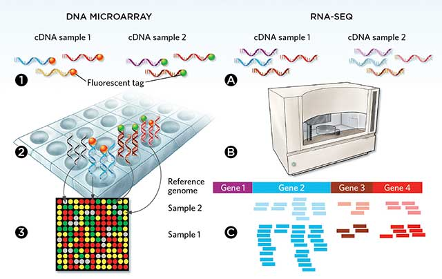
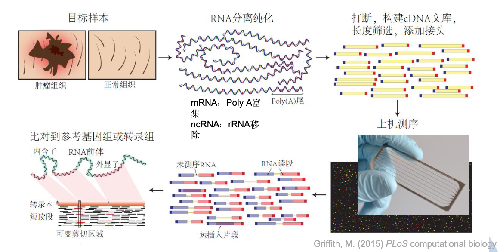

```{r, eval=TRUE, echo=FALSE, output=FALSE}
showtext::showtext_auto()
```

# 课程大纲

## 本讲内容

::: {.columns}
::: {.column width="50%"}
1. **RNA-seq技术简介**
2. **实验流程与文库制备**
3. **测序原理与平台**
4. **实验设计原则**
:::
::: {.column width="50%"}
5. **批次效应与控制**
6. **数据质控指标**
7. **测序深度与重复数**
8. **常见问题**
:::
:::

---

# 第1部分：RNA-seq技术简介

## 1.1 什么是RNA-seq？

> **RNA-seq（RNA sequencing）** 是利用高通量测序技术对转录组进行定量和定性分析的方法

### RNA-seq的核心能力

- **定量分析** — 测定每个基因的转录本丰度
- **差异分析** — 比较不同条件下基因表达变化
- **新转录本发现** — 鉴定新的基因和剪接异构体
- ...

---

## 1.2 RNA-seq vs 芯片技术

::: {.columns}
{fig-align="right" width="50%"}
:::

| 特性 | RNA-seq | 芯片（Microarray） |
|------|---------|-------------------|
| **检测范围** | 全转录组（已知+未知） | 预设探针（已知基因） |
| **灵敏度** | 高，可检测低表达基因 | 中等，受背景噪音影响 |
| **动态范围** | 宽（>10^4） | 窄（~10^2） |
| **发现能力** | 新转录本、融合基因 | 限于已知序列 |
| **成本** | 逐渐降低 | 相对较低 |

**结论**：RNA-seq已成为转录组研究的标准方法

---

## 1.3 RNA-seq生物医学应用

::: {.columns}
::: {.column width="50%"}
### 研究领域

- 🧬 **肿瘤研究** — 癌症驱动基因、分型标志物
- 💊 **药物研发** — 药物反应预测、靶点发现
- 🧫 **发育生物学** — 时空表达模式分析
- 🦠 **免疫学** — 免疫细胞活化状态评估
:::
::: {.column width="50%"}
### 临床转化

- 疾病分子分型
- 预后标志物发现
- 治疗靶点筛选
- 精准医疗指导
:::
:::

---

# 第2部分：实验流程

## 2.1 整体流程图

::: {.columns}
{fig-align="center" width="60%"}
:::


**关键质控点**：

- RNA完整性（RIN > 7）
- 文库浓度和片段大小
- 测序质量（Q30 > 85%）

---

## 2.2 RNA提取与质控

### 关键指标

| 指标 | 要求 | 说明 |
|------|------|------|
| **RIN值** | > 7 | RNA完整性，Bioanalyzer检测 |
| **浓度** | >100 ng/μL | NanoDrop或Qubit检测 |
| **纯度** | A260/A280 = 1.8-2.1 | 蛋白污染检测 |

::: {.callout-warning}
**注意**：RNA易降解，提取后应立即进行后续步骤或-80°C保存
:::

---

## 2.3 mRNA富集策略

::: {.columns}
::: {.column width="50%"}
### poly-A选择
**适用**：真核生物、完整RNA样本

**优点**：

- 富集成熟mRNA
- 数据利用率高
- rRNA污染低

**缺点**：

- 丢失非编码RNA
- 无poly-A的转录本丢失
- 不适合降解样本
:::
::: {.column width="50%"}
### rRNA去除
**适用**：原核生物、降解样本

**优点**：

- 保留非编码RNA
- 更全面的转录组
- 适合FFPE样本

**缺点**：

- rRNA残留可能较高
- 数据复杂度增加
:::
:::

---

# 第3部分：测序原理

## 3.1 Illumina测序（边合成边测序）

### 原理步骤

1. **文库变性** — 双链DNA变性为单链
2. **杂交** — 与flow cell上的接头序列结合
3. **桥式PCR扩增** — 形成簇（cluster）
4. **测序引物结合**
5. **循环测序** — 加入荧光标记的dNTP
6. **图像采集** — 读取每个碱基的荧光信号

- [在线视频 - B 站](https://www.bilibili.com/video/BV1W44y1373N/?spm_id_from=333.337.search-card.all.click&vd_source=295fe87a6b67e73540bc390bf01d423e)

---

## 3.2 测序模式选择

| 模式 | read长度 | 应用场景 | 成本 |
|------|----------|----------|------|
| **SE50** | 50 bp单端 | 基因表达定量 | 低 |
| **SE75** | 75 bp单端 | 常规表达分析 | 中 |
| **PE100** | 100 bp双端 | 剪接分析、新转录本 | 高 |
| **PE150** | 150 bp双端 | 复杂转录组、融合基因 | 最高 |

**推荐**：一般表达分析用PE100-150

---

## 3.3 测序深度与重复数

### 推荐测序深度

| 分析类型 | reads/样本 | 说明 |
|----------|------------|------|
| **基因表达定量** | 10-30 M | 标准差异分析 |
| **差异剪接** | 50-100 M | 需要更高覆盖度 |
| **融合基因检测** | >100 M | 低丰度事件检测 |
| **单细胞测序** | 50K-500K/细胞 | 依细胞类型而定 |

### 生物学重复数

- **n=3**：最低要求（细胞系）
- **n=4-5**：推荐（人临床样本）
- **n≥6**：高异质性样本

**原则**：生物学重复 > 测序深度

---

# 第4部分：实验设计

## 4.1 实验设计基本原则

```
1. 对照组设置 — 必须设置对照组
2. 随机化 — 样本处理顺序随机
3. 平衡设计 — 各组样本数相等
4. 盲法 — 减少操作偏差
5. 详细记录 — 批次、日期、操作者
```

::: {.callout-important}
**关键**：实验设计决定分析的上限，设计缺陷无法通过分析弥补
:::

---

## 4.2 常见实验设计类型

### 两两比较（最常见）

```
对照组 (n=3)    vs    处理组 (n=3)
   ↓                    ↓
 提取RNA              提取RNA
   ↓                    ↓
建库测序             建库测序
   ↓                    ↓
   ←—— 差异分析 ——→
```

### 配对设计

```
同一患者：治疗前 (n=20) vs 治疗后 (n=20)
        ↓
配对分析：控制个体差异，提高统计效能
```

---

# 第5部分：批次效应

## 5.1 什么是批次效应？

**批次效应（Batch Effect）**：由非生物学因素引起的系统性差异

### 主要来源

| 来源 | 影响程度 | 示例 |
|------|----------|------|
| **操作者** | 高 | 不同人员操作习惯差异 |
| **时间** | 高 | 不同日期提取RNA |
| **试剂批次** | 中 | 不同批次试剂性能差异 |
| **仪器** | 中 | 不同测序仪、flow cell |

---

## 5.2 批次效应识别

### 可视化方法

- **PCA** — 批次是否聚类在一起
- **热图聚类** — 样本是否按批次聚类
- **UMAP/t-SNE** — 高维数据可视化

### 异常表现

```
❌ 错误：样本按批次聚类，而非生物学分组
✅ 正确：样本按生物学条件聚类
```

---

## 5.3 批次效应控制

### 设计阶段控制（首选）

```
✅ 推荐：块设计（Block Design）

Day 1: 对照1-3 + 处理1-3
Day 2: 对照4-6 + 处理4-6

❌ 避免：
Day 1: 所有对照组
Day 2: 所有处理组
```

### 分析阶段校正

| 方法 | R包 | 适用场景 |
|------|-----|----------|
| ComBat | sva | 已知批次变量 |
| ComBat-seq | sva | RNA-seq计数数据 |
| 纳入设计公式 | DESeq2 | 批次作为协变量 |

---

# 第6部分：数据质控

## 6.1 测序质量分数（Phred Score）

```
Q = -10 × log10(P)  （P为错误概率）
```

| Q值 | 准确率 | 错误率 | 评价 |
|-----|--------|--------|------|
| 30 | 99.9% | 0.1% | 优秀 |
| 20 | 99% | 1% | 可接受 |
| <20 | <99% | >1% | 差 |

**要求**：Q30 > 85%

---

## 6.2 比对率指标

| 指标 | 可接受 | 良好 | 优秀 |
|------|--------|------|------|
| 总比对率 | >70% | >85% | >90% |
| 唯一比对率 | >60% | >75% | >85% |
| rRNA比例 | <10% | <5% | <2% |

::: {.callout-warning}
**低比对率可能原因**：

- 接头未去除干净
- 样本污染
- 参考基因组选择错误
:::

---

# 第7部分：常见问题

## 7.1 RNA-seq常见问题

### Q1: 选择poly-A还是rRNA去除？

- **完整RNA+真核生物** → poly-A
- **降解样本/原核生物** → rRNA去除

### Q2: 单端还是双端测序？

- **仅表达定量** → SE75
- **剪接分析/新转录本** → PE100-150

### Q3: 如何判断测序深度是否足够？

- 基因检出数（通常>10,000）
- 饱和曲线分析
- 样本间相关性

---

## 7.2 实验设计检查清单

- [ ] 是否设置了对照组？
- [ ] 每组至少3个生物学重复？
- [ ] 样本收集条件是否一致？
- [ ] 是否考虑了性别、年龄等混杂因素？
- [ ] 是否记录了批次信息？
- [ ] 是否进行了随机化处理？

---

# 总结

## RNA-seq实验要点

1. **技术优势** — 全转录组覆盖、高灵敏度、发现新转录本
2. **实验流程** — RNA提取 → mRNA富集 → 片段化 → cDNA合成 → 接头连接 → 测序
3. **测序参数** — PE100-150用于剪接分析，10-30M reads/样本，n≥3重复
4. **实验设计** — 对照组、随机化、平衡设计、详细metadata记录
5. **批次效应** — 设计阶段控制优于分析阶段校正

---

# 谢谢！

## 联系方式

- 📧 wangshx@csu.edu.cn
- 🌐 https://wanglabcsu.github.io/
- 🐙 https://github.com/WangLabCSU

---

## 延伸阅读

1. Wang Z, et al. RNA-Seq: a revolutionary tool for transcriptomics. Nat Rev Genet. 2009
2. Conesa A, et al. A survey of best practices for RNA-seq data analysis. Genome Biol. 2016
3. Leek JT, et al. Tackling the widespread and critical impact of batch effects. Nat Rev Genet. 2010
